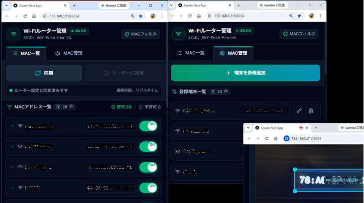
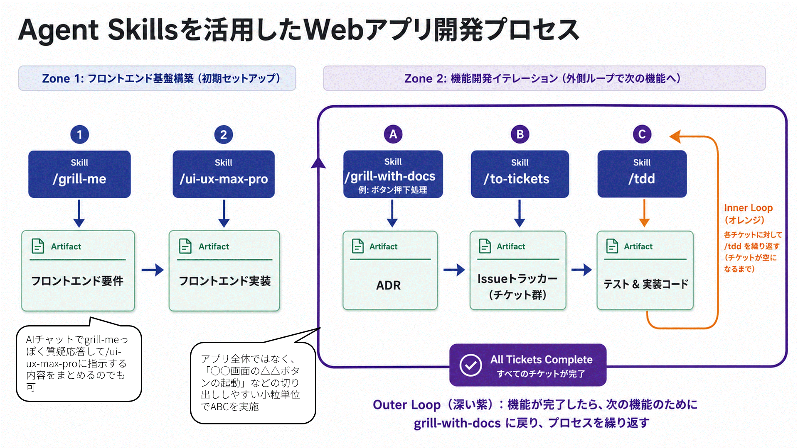

# [Agent Skills] mattpocock

`Agent Skills` `開発`

## 📋 概要
- [YouTube数理の弾丸](https://youtu.be/VKuZeNlz_2o)で解説されている[mattpocock](https://github.com/mattpocock/skills)さんのスキルを活用した開発プロセスを参考にしてみる
- コーディング作業ゼロでWebアプリが完成した（単に最新のLLMがすごいだけかもしれないけど、スキルやプロセスによる効果もあるはず・・）

---

## 🎬 生成させてみた例

### 開発対象概要
- Webアプリ（next.js, sqlite）
- WifiルータのMacアドレスフィルタリングの管理コンソール
- 機能
  - デバイス＝Macアドレスの登録編集削除
  - フィルタリングでのデバイスの許可・不許可切替
  - Macアドレス登録時のカメラOCRでのMacアドレス読み取り

  

### 開発プロセス



### ① フロントエンド要件の生成

Geminiチャットで質疑応答し、「画面要件」をmarkdownドキュメントとして生成

プロンプト：
`````
提示するテーマに対し、あらゆる側面について、私たちが共通理解に達するまで徹底的に質問してください。
決定ツリーの各枝をたどり、決定事項間の依存関係を一つずつ解決していきましょう。
それぞれの質問に対して、あなたの推奨する回答を提示してください。

一度に複数の質問をすると、混乱を招く可能性があります。
質問は一つずつ行い、それぞれの質問に対する回答を待ってから次の質問に進んでください。

参照可能な情報を調べることで分かる事実であれば、私に尋ねるのではなく、自分で調べてください。
ただし、最終的な決定権は私にあります。一つ一つ私に尋ねて、私の回答をお待ちください。

双方の合意が得られたことを確認するまでは、総括しないでください。
総括のタイミングは私が指示します。
しかし、議論の間、決定事項を忘れないよう、質問と回答のターンごとに、それまでの議論ポイントと決定事項を簡潔に箇条書きにして提示してください。

それでは始めましょう。テーマは次の通りです。

```
コーディングエージェントに画面の生成を指示するための要件を整理したい。
現状で想定している要件は：
- next.jsで実装
- デザインはダークかつシンプルかつ視認性重視かつハイセンス
- スマホでの操作性を想定し、垂直分割はなし。
- WIFIルータを管理するアプリの一部であり、WIFIルータに接続を許可するMACアドレスの一覧を表示しつつ、アドレスごとの許可・不許可をスイッチボタンで切り替えられる
- 画面構成は以下のとおり
  - メニューボタン（MAC一覧、MAC管理）
  - WIFIルータに設定を反映するボタン
  - MAC一覧
    - 名前、MACアドレス、スイッチボタンが横並び（一覧は一度に表示される数を多くするため、要素をすべて横並びで表示）
```
`````

### ② フロントエンド実装

以降はAntigravity CLIで進める

```
/ui-ux-max-pro docs/画面要件-MAC一覧.md
```

### A 実装要件をADRとして生成

```
/grill-with-docs
`MAC一覧`の`同期`ボタンの実装を行います。このボタンをクリックすると、まずWIFIルータに対して登録済のMACアドレスの取得を要求します。MAC一覧に表示するのは、DBに登録済またはWIFIルータから取得されたMACアドレスです。なぜなら、WIFIルータから取得されるMACアドレスは許可されたもののみのため、不許可状態のMACアドレスはDBからのみ取得可能だからです。一覧を表示する際は、スイッチのON/OFFの状態も適切に設定します。WIFIルータから取得されるMACアドレスは許可されたものです。DBから追加的に取得されたMACアドレスは不許可状態です。また、`同期`ボタンをクリックした際には、WIFIルータに登録済のMACアドレスとDBにでの登録状態を同期します。これは、WIFIルータから取得される情報を正とします。DBに登録されていないMACアドレスは、DBにレコードを追加します。WIFIルータ上とDBとでデバイス名が異なる場合は、WIFIルータから取得されたデバイス名でDBを更新します。
```

### B ADRをもとにチケット化

```
/to-tickets docs/adr/0004-sync-mac-devices-from-router.md
```

### C チケットを刈り取りながらテスト駆動開発

```
/tdd
```

全てのチケットが完了になったら、動作確認してみて、問題なければ、Aに戻って次の機能を開発。

### 不具合解消

動作確認でうまく動いていない場合は、Aの指示で原因の特定と対応方法を依頼、ADR化してBCを実施

```
/grill-with-docs
`MAC一覧`の`同期`ボタンをクリックしても、WIFIルータに登録されているデバイス情報が一覧に反映されません。その原因を特定し、修正方針を定めたいです。
```

---

## 🛠️ 再現手順
### 前提環境
- **使用ツール：** Gemini チャット、Antigravity CLI（Gemini 3.6 Flash high）　# 主要なSkillsが使えるエージェントなら何でもよいはず
- **環境：** VSCode Dev Container（wslc）でpythonとnodejsとrustはインストール済

### Agent Skillsのインストール

[https://github.com/nextlevelbuilder/ui-ux-pro-max-skill](https://github.com/nextlevelbuilder/ui-ux-pro-max-skill) の `Using CLI` の手順のとおり：
- `npm install -g ui-ux-pro-max-cli` でインストール
- 空フォルダを作成してcd
- `uipro init --ai antigravity` (使用するコーディングエージェントに合わせる）

メインとなるmattpocockさんのスキルをインストール
- `npx skills@latest add mattpocock/skills`

### Issueトラッカーのインストール

今回は試しにローカルで動作するissueトラッカを利用（本来はGitHub issueなどが推奨されている）
- `cargo install lissue`

以降は開発プロセスに沿って進める。
