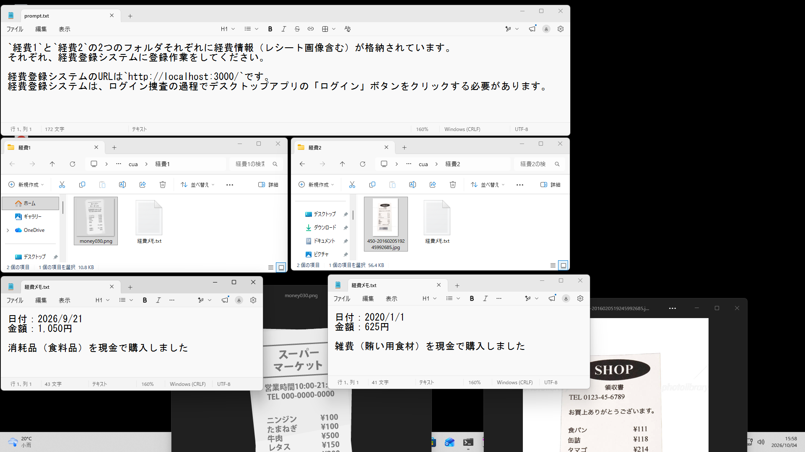
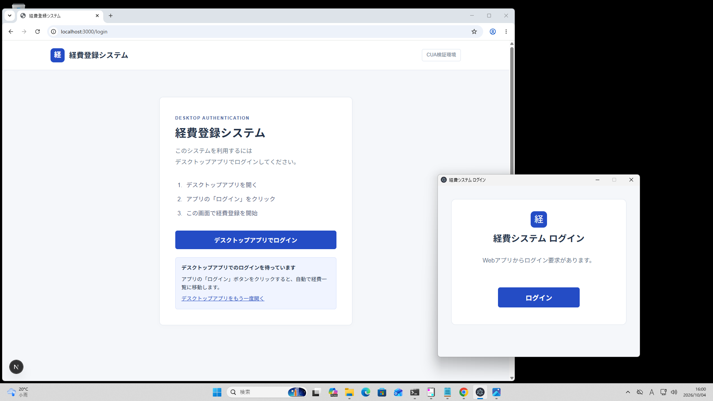
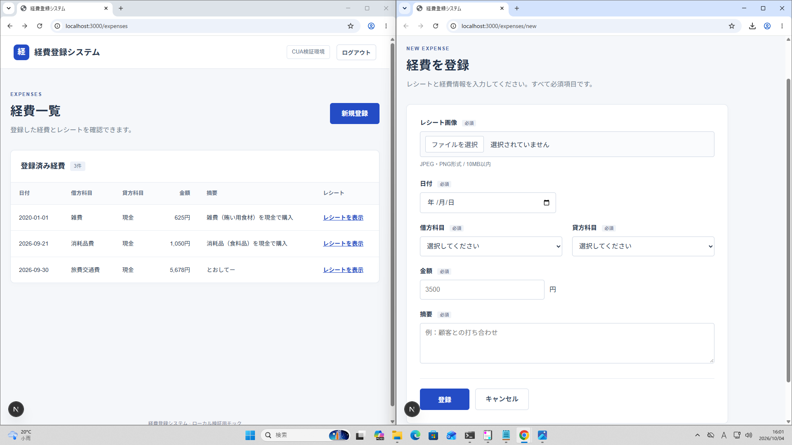
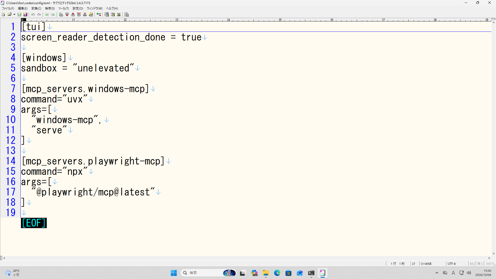
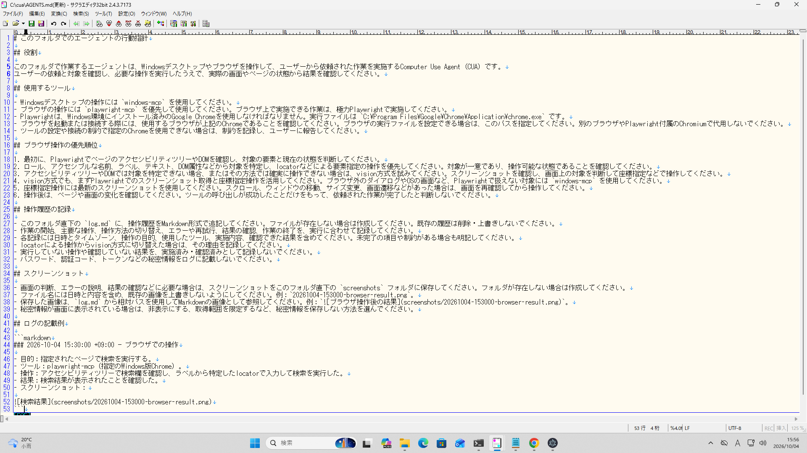
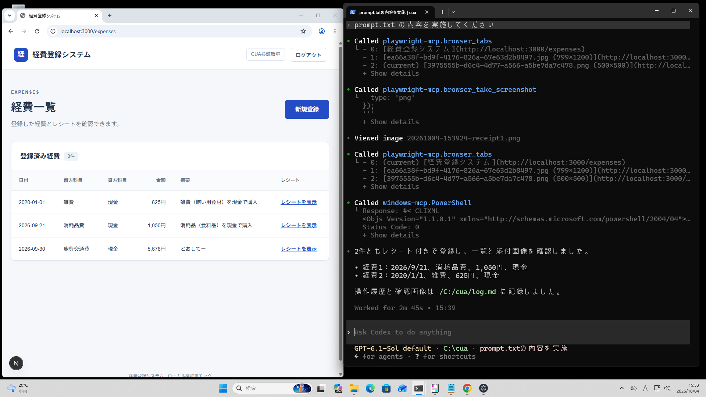
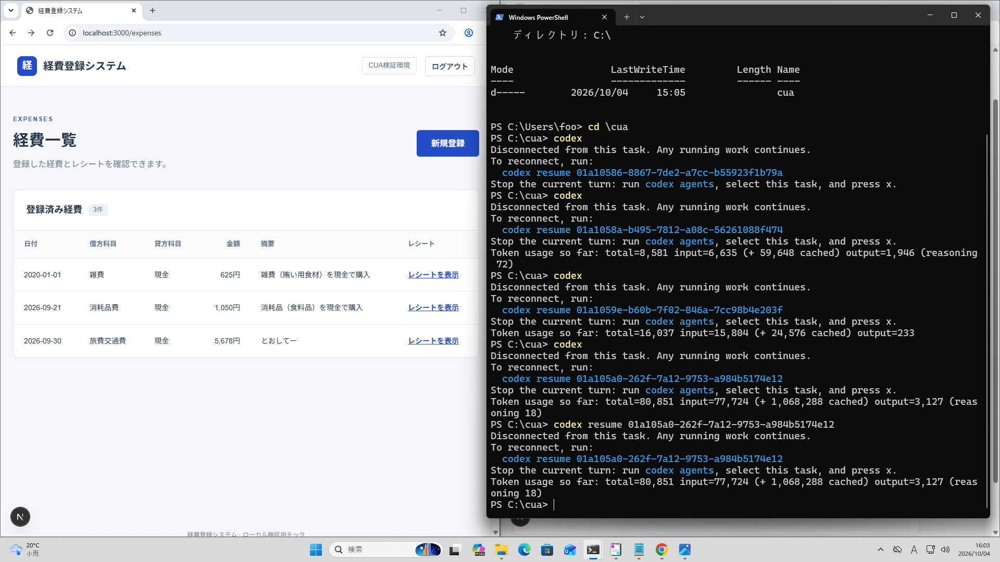

# [MCP] Codex CLI で Computer Use

`MCP` `Computer Use`

## 📋 概要

- Codex CLIにWindows操作とブラウザ操作それぞれに特化したMCPをセットアップしてComputer Use Agent(CUA)にしてみる
- デバイス認証のようにブラウザのログイン過程でデスクトップアプリも操作するような挙動を期待
- 全く問題なく動作した

---

## 🎬 生成させてみた例

### CUAにさせたいこと

### CUAに操作させるサンプルアプリ

#### ログイン時にデスクトップアプリが開いて「ログイン」ボタンをクリックする必要がある(playwrightでは操作不可)

#### 経費の登録と一覧表示を行う画面を持つ

### Codex CLIに`windows-mcp`と`playwright-mcp`を設定

### [AGENTS.md](AGENTS.md)に前提情報を記述

### プロンプトの実行結果（ちゃんと指示したことを完遂！すごい！）

### 料金はトークン数でAPI単価で計算すると0.3ドル弱（45円くらい）

---

## 🛠️ 再現手順

### 前提環境

- **使用ツール：** OpenAI Codex CLI（gpt-6.1-sol low）
- **環境：** Windows11

### MCPの設定やプロンプトは上記スクリーンショットなど参照
